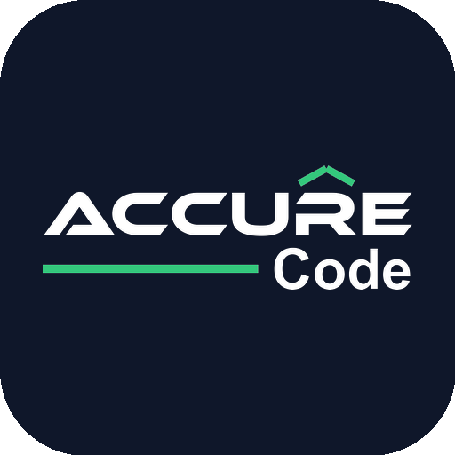
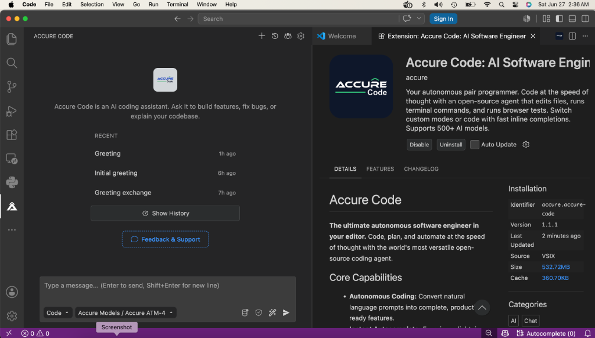

<p align="center">
  <a href="README.md">English</a> | <a href="README.zh.md">简体中文</a> | <a href="README.zht.md">繁體中文</a> | <a href="README.ko.md">한국어</a> | <a href="README.de.md">Deutsch</a> | <a href="README.es.md">Español</a> | <a href="README.fr.md">Français</a> | <a href="README.it.md">Italiano</a> | <a href="README.da.md">Dansk</a> | <a href="README.ja.md">日本語</a> | <a href="README.pl.md">Polski</a> | <a href="README.ru.md">Русский</a> | <a href="README.bs.md">Bosanski</a> | <a href="README.ar.md">العربية</a> | Norsk | <a href="README.br.md">Português (Brasil)</a> | <a href="README.th.md">ไทย</a> | <a href="README.tr.md">Türkçe</a> | <a href="README.uk.md">Українська</a> | <a href="README.bn.md">বাংলা</a> | <a href="README.gr.md">Ελληνικά</a> | <a href="README.vi.md">Tiếng Việt</a>
</p>

<p align="center">
  <a href="https://accure.ai"></a>
</p>

<p align="center">Den åpne kildekodeagenten for å bygge med AI i VS Code, JetBrains eller CLI.</p>



---

Accure Code er en AI-kodeagent som møter deg overalt du jobber: [VS Code](https://accure.ai/landing/vs-code), [JetBrains](https://accure.ai/features/jetbrains-native) og [CLI](https://accure.ai/cli). Den er åpen kildekode med åpen prising. Du velger blant mer enn 500 modeller, bytter mellom dem midt i en oppgave og betaler modellleverandørens pris uten påslag. Ingen API-nøkler kreves for å starte.

### Installasjon

Velg hvor du vil kjøre Accure.

<details open>
<summary><strong>VS Code</strong></summary>

<br>

Installer [Accure Code-utvidelsen](vscode:extension/accurecode.accure-code) direkte, eller hent den fra [VS Code Marketplace](https://marketplace.visualstudio.com/items?itemName=accurecode.Accure-Code). Opprett en konto, og du får tilgang til mer enn 500 modeller, inkludert GPT-5.5, Claude Opus 4.7, Claude Sonnet 4.6 og Gemini 3.1 Pro Preview, alle til leverandørpris.

</details>

<details open>
<summary><strong>CLI</strong></summary>

<br>

```bash
# npm
npm install -g @accurecode/cli

# curl
curl -fsSL https://accure.ai/cli/install | bash

# pnpm
pnpm add -g @accurecode/cli

# bun
bun add -g @accurecode/cli

# Homebrew (macOS / Linux)
brew install Accure-Org/tap/accure

# Arch Linux (AUR)
paru -S accure-bin
```

Kjør deretter `accure` i en prosjektmappe for å starte.

</details>

### Agents

Accure leveres med spesialiserte agents du kan bytte mellom avhengig av oppgaven. Du kan også bygge dine egne egendefinerte agents.

- **Code** - Standard. Implementerer og redigerer kode fra naturlig språk.
- **Plan** - Designer arkitektur og skriver implementeringsplaner før kode skrives.
- **Ask** - Svarer på spørsmål om kodebasen uten å endre filer.
- **Debug** - Feilsøker og sporer problemer.
- **Review** - Gjennomgår endringene dine og finner problemer med ytelse, sikkerhet, stil og testdekning.

Les mer om [agents og egendefinerte agents](https://accure.ai/docs/code-with-ai/agents/using-agents).

### Hva den gjør

- **Kodegenerering** fra naturlig språk, på tvers av flere filer.
- **Inline-autofullføring** med ghost-text-forslag og Tab for å godta.
- **Selvsjekking** slik at agenten vurderer og retter sitt eget arbeid.
- **Terminal- og nettleserkontroll** for å kjøre kommandoer og automatisere nettet.
- **MCP-markedsplass** for å finne og koble til MCP-servere som utvider hva agenten kan gjøre.
- **Mer enn 500 modeller** med bytte midt i oppgaven, slik at du kan matche latenstid, kostnad og resonnering til jobben.

### Autonom modus (CI/CD)

Kjør `accure run` med `--auto` for helt autonom drift uten spørsmål, bygget for CI/CD-pipelines:

```bash
accure run --auto "run tests and fix any failures"
```

`--auto` deaktiverer alle tillatelsesspørsmål og lar agenten utføre enhver handling uten bekreftelse. Bruk det bare i betrodde miljøer.

### Dokumentasjon

For konfigurasjon og alt annet, se [dokumentasjonen](https://accure.ai/docs).

### Bidra

Bidrag er velkomne fra utviklere, skribenter og alle andre. Start med [Contributing Guide](/CONTRIBUTING.md) for miljøoppsett, kodestandarder og hvordan du åpner en pull request. Se [RELEASING.md](RELEASING.md) for releaseprosessen for VS Code-utvidelsen og CLI-en, og [packages/accure-jetbrains/RELEASING.md](packages/accure-jetbrains/RELEASING.md) for JetBrains-pluginen.

Les vår [Code of Conduct](/CODE_OF_CONDUCT.md) før du deltar.

### Lisens

MIT. Du kan bruke, endre og distribuere denne koden, også kommersielt, så lenge du beholder attribusjons- og lisensmerknadene. Se [License](/LICENSE).

### FAQ

<details>
<summary>Hvor kommer Accure CLI fra?</summary>

Accure CLI er en fork av [OpenCode](https://github.com/Accure-Org/accurecode), forbedret for å fungere i Accure agentic engineering-plattformen.

</details>

---

**Bli med i fellesskapet** [Discord](https://accure.ai/discord) | [X](https://x.com/accurecode) | [Reddit](https://www.reddit.com/r/accurecode/)
